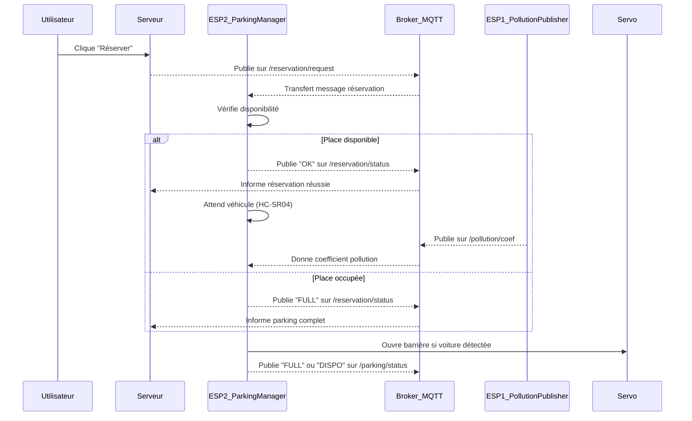

```mermaid
sequenceDiagram
    participant Utilisateur
    participant Serveur
    participant ESP2_ParkingManager
    participant Broker_MQTT
    participant ESP1_PollutionPublisher

    Utilisateur ->> Serveur: Clique "Réserver"
    Serveur -->> Broker_MQTT: Publie sur /reservation/request
    Broker_MQTT -->> ESP2_ParkingManager: Transfert message réservation

    ESP2_ParkingManager ->> ESP2_ParkingManager: Vérifie disponibilité
    alt Place disponible
        ESP2_ParkingManager -->> Broker_MQTT: Publie "OK" sur /reservation/status
        Broker_MQTT -->> Serveur: Informe réservation réussie
        ESP2_ParkingManager ->> ESP2_ParkingManager: Attend véhicule (HC-SR04)
        ESP1_PollutionPublisher -->> Broker_MQTT: Publie sur /pollution/coef
        Broker_MQTT -->> ESP2_ParkingManager: Donne coefficient pollution
    else Place occupée
        ESP2_ParkingManager -->> Broker_MQTT: Publie "FULL" sur /reservation/status
        Broker_MQTT -->> Serveur: Informe parking complet
    end

    ESP2_ParkingManager ->> Servo: Ouvre barrière si voiture détectée
    ESP2_ParkingManager -->> Broker_MQTT: Publie "FULL" ou "DISPO" sur /parking/status
```
