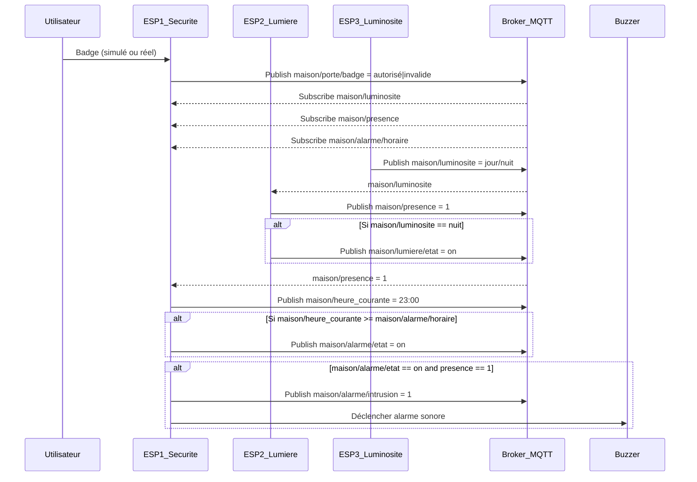

# Scénario 
 ``` 
   Lorsqu’un utilisateur badge devant la porte, l’ESP-1 vérifie la validité du badge (simulé ou réel).

   Si le badge est valide, il désactive l’alarme ; sinon, il reste en mode surveillance. 
   À l’intérieur, un capteur PIR sur l’ESP-2 détecte toute présence. 
   
   Si une présence est détectée et que la luminosité, mesurée par l’ESP-3, indique qu’il fait nuit, alors l’ESP-2 allume la lumière.
   L’ESP-2 informe aussi l’ESP-1 de toute présence détectée.
   
   Si l’alarme est activée (manuellement ou automatiquement à une heure planifiée, comme 23h via le topic alarme/horaire) et qu’une présence est détectée dans la maison, l’ESP-1 déclenche le buzzer d’alarme.
   
```
## Diagramme de Séquence




## 📶 Tableau global de communication MQTT – Comportement des ESP

| **Topic**                      | **Message**             | **Publié par**   | **Reçu par (abonné)**            | **Action déclenchée**                                              |
|-------------------------------|--------------------------|------------------|-----------------------------------|----------------------------------------------------------------------|
| `maison/porte/badge`          | `autorisé` / `invalide` | ESP-1 (simulé)   | ESP-1                             | Active/désactive surveillance                                       |
| `maison/alarme/etat`          | `on` / `off`            | ESP-1 ou Web     | ESP-1, ESP-2                      | Active mode alarme                                                  |
| `maison/presence`             | `1` / `0`               | ESP-2            | ESP-1                             | Déclenche alarme si alarme est `on`                                 |
| `maison/luminosite`           | `jour` / `nuit`         | ESP-3            | ESP-2, ESP-1                      | ESP-2 : allume lumière si nuit ; ESP-1 : ignore badge si jour       |
| `maison/lumiere/etat`         | `on` / `off`            | ESP-2            | Interface Web (optionnel)         | Visualisation de l’état de la lumière                              |
| `maison/alarme/horaire`       | `23:00` (ou autre)      | Interface Web    | ESP-1                             | Planifie l’activation de l’alarme à l’heure donnée                 |
| `maison/heure_courante`       | `HH:MM`                 | ESP-1            | ESP-1                             | Compare avec l’heure planifiée pour activer automatiquement         |
| `maison/alarme/intrusion`     | `1`                     | ESP-1            | Interface Web (optionnel)         | Signal visuel d’alerte intrusion                                    |

---


## 🧠 Résumé des rôles :

| ESP      | Publie                                       | S’abonne à                                           | Actions principales                                               |
|----------|----------------------------------------------|------------------------------------------------------|-------------------------------------------------------------------|
| **ESP-1** | `badge`, `alarme/intrusion`, `alarme/etat`, `heure_courante` | `presence`, `luminosite`, `alarme/horaire`             | Déclenche alarme, centralise la sécurité                         |
| **ESP-2** | `presence`, `lumiere/etat`                  | `luminosite`, `alarme/etat`                          | Allume lumière si présence + nuit, informe ESP-1                  |
| **ESP-3** | `luminosite`                               | —                                                    | Mesure et envoie l’état du jour ou de la nuit                    |

